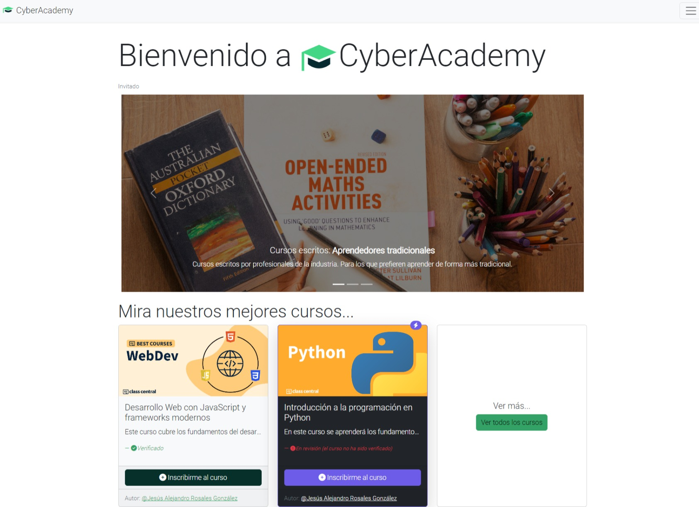

# Cyber Academy

Bienvenido al repositorio de Cyber Academy, una revolucionaria plataforma de aprendizaje en línea. Esta aplicación está desarrollada utilizando Laravel, Vue.js y Oracle DB.

## Características
- Cursos disponibles en tres formatos: audio, video y documentos escritos
- Sistema de calificación de cursos
- Mensajería en línea entre profesores y estudiantes
- Sistema de suscripción
- Disponible en inglés y español

## Tecnologías
- Laravel
- Vue.js
- Oracle DB
- MongoDB
### Testeo
- Stripe
- PayPal
- Cashier

## Instalación

### Requisitos
- PHP >= 7.4
- Node.js >= 14.0.0
- Composer
- Oracle DB
- MongoDB

### Pasos
1. Clonar el repositorio: `git clone https://github.com/---/cyber-academy.git`
2. Ir al directorio del proyecto: `cd cyber-academy`
3. Instalar dependencias de PHP con Composer: `composer install`
4. Instalar dependencias de JavaScript con npm: `npm install`
5. Copiar el archivo `.env.example` a `.env` y configurar las variables de entorno
6. Generar la clave de la aplicación: `php artisan key:generate`
7. Ejecutar las migraciones: `php artisan migrate`
8. Compilar los assets: `npm run dev`
9. Arrancar el servidor de desarrollo: `php artisan serve`

## Contribuciones
Las contribuciones son bienvenidas. Por favor, abre un issue o realiza un pull request.

## Licencia
Cyber Academy está licenciado bajo la licencia MIT. Ver [LICENSE](LICENSE) para más detalles.
